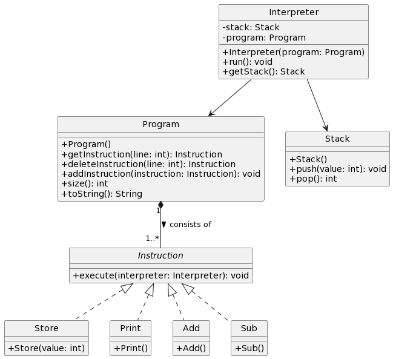

# CalcVM
In dieser Aufgabe soll eine kleine virtuelle Maschine (also ein Interpreter) für die Berechnung von mathematischen Ausdrücken umgesetzt werden.

## Die Sprache
Mithilfe der VM können Programme einer sehr einfachen Programmiersprache interpretiert werden. Die Sprache kennt folgende Befehle. Dabei werden keine Variablen unterstützt, stattdessen können Zwischenergebnisse in einem [Stack](https://de.wikipedia.org/wiki/Stapelspeicher) abgelegt werden.

- `Store value`: Speichert den Wert `value` am Stack.
- `Add`: Liest zwei Werte vom Stack, berechnet deren Summe und speichert das Ergebnis wieder am Stack.
- `Sub`: Liest zwei Werte vom Stack, berechnet deren Differenz (dabei wird der oberste Wert am Stack von dem darunter abgezogen) und speichert das Ergebnis wieder am Stack.
- `Print`: Liest den obersten Wert vom Stack und gibt ihn auf der Konsole aus.

Ein einfaches Programm zur Berechnung von "3 + 5" sieht so aus:

```
Store 3
Store 5
Add
Print
```

## Umsetzung
Für die Umsetzung der VM wurde bereits einiges an Vorarbeit geleistet. Unten siehst du das Klassendiagramm, auf dem die Implementierung basiert. Dabei sind grundsätzliche alle Klassen, die du für die Umsetzung der (GK) Aufgabe benötigst in dem Diagram enthalten. Selbstverständlich darfst du auch zusätzliche Klassen einfügen.



Aufbauend auf dieser Klassenstruktur und dem vorgegebenen Code sollst du nun die Anwendung vervollständigen. Beachte dabei besonders:

- Alle Stellen, an denen du Code einfügen musst wurden mit einem `// TODO` Kommentar versehen. Die Klassen `Program` und `Stack` müssen von dir noch erstellt und implementiert werden.
- Programme bestehen aus einer Liste an Instruktionen. Nutze für die Implementierung der Klasse `Program` eine geeignete Klasse, die das [`java.util.List` Interface](https://docs.oracle.com/javase/8/docs/api/java/util/List.html) implementiert.
- Die Klasse `Stack` implementiert einen [Stack-Speicher](https://de.wikipedia.org/wiki/Stapelspeicher) wie du ihn bereits aus der vorherigen Aufgabe "Generic-Stack" kennst. Anders als bei vorherigen Aufgabe muss dieser Stack zwar nicht generisch sein, soll jedoch (zumindest theoretisch) keine Größenlimitierung haben und ebenfalls auf einer geeigneten Java-Collection basieren.
- Außer für lokale Zwischenvariablen dürfen in dieser Aufgabe generell **keine Arrays** verwendet werden!
- Die `toString` Methode der Klasse `Program` soll das Programm in einer Notation wie oben unter "Die Sprache" dargestellt zurückgeben.
- Sei für das Abgabegespräch darauf vorbereitet zu erklären, aus welchen Gründen du dich bei der Implementierung des Stacks bzw. der `Program`-Klasse für den jeweiligen Listentypen entschieden hast.

## Erweitere Kompetenzen
Um unsere kleiner Programmiersprache noch um einiges mächtiger zu machen, soll sie nun wie folgt erweitert werden.

Unsere VM wird um einen zweiten Stack erweitert, dabei nennen wir einen Stack Eingabespeicher und den anderen Stack Ausgabespeicher. Alle Instruktionen arbeiten so, dass sie vom Eingabespeicher lesen und in den Ausgabespeicher schreiben. Ändere dies bei den bereits bestehenden Befehlen entsprechend um.

Weiter werden folgende neue Befehle hinzugefügt:

- `Jump line`: Mit diesem Befehl springt der Interpreter an die angegebene Programmzeile. (Dafür muss die Instruktion auf den Interpreter zugreifen und das Programm auf die richtige Zeile setzen.)
- `JumpZ line`: Liest einen Wert vom Eingabestack. Falls dieser Wert == 0 ist, springt das Programm an die Zeile `line`. Anderenfalls setzt das Programm wie gewöhnlich an der nächsten Zeile fort. Im Fall, dass kein Sprung stattfindet, wird der gelesene Wert zusätzlich wieder auf den Ausgabestack geschrieben.
- `ShiftIn`: Dieser Befehl verschiebt den obersten Wert vom Eingabestack auf den Ausgabestack.
- `ShiftRes`: Dieser Befehl verschiebt den obersten Wert vom Ausgabestack auf den Eingabestack. Er stellt somit eine Ausnahme zur Regel dar, dass Operationen immer vom Eingabestack lesen und auf den Ausgabestack schreiben.
- `StoreRes value`: Während `Store value` weiterhin auf den Eingabestack schreibt, kann dieser Befehl benutzt werden, um Werte auf den Ausgabestack zu schreiben.

### EKÜ
Implementiere nun ein Programm für deine VM, das eine selbstgewählte Aufgabestellung implementiert. Es darf sich dabei jedoch nicht um ein triviales Programm handeln, das von den neu eingeführten Befehlen (insbesondere den Sprüngen) keinen Gebrauch macht!

### EKV
Entwickle ein Programm für deine VM, das die Multiplikation zweier Zahlen umsetzt. **Hint:** Die Multiplikation ist nichts anderes als eine wiederholte Addition.
